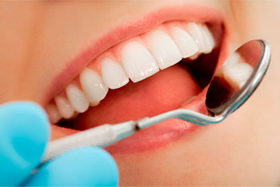

O **Day Clinic** é o conceito de otimizar ao máximo o tempo de tratamento para o paciente. Nele, ao invés de ir várias vezes ao dentista ao longo do mês, nós realizamos o maior número de intervenções odontológicas num único dia ou em poucos dias, desde que haja condições para tal.

Esse novo método de atendimento pode ser realizado para qualquer tipo de pessoa, mas a maior procura é para quem tem pouco tempo livre durante o dia ,como executivos, ou para quem esta de passagem pela cidade, como turistas, e que necessitem de atendimento odontológico. Afinal, nos dias atuais, além da qualidade, as pessoas demandam por agilidade no tratamento.

Praticamente todo tipo de procedimento, seja facetas, [implantes](/tratamentos/implante-dental "Implantodontia"), coroas, [tratamentos estéticos](/tratamentos/estetica-dos-dentes "Estética") ou sisos podem ser realizados através do conceito **day clinic**. Mas para isso, temos que realizar consultas prévias de planejamento, como a realização de raio x , tomografias e modelos de estudo.

A clinica também deve possuir um [espaço adequado](/estrutura "Estrutura") para o paciente repousar, consultórios equipados e prontos para atender qualquer tipo de emergência. Também é necessário um laboratório de prótese que irá trabalhar junto com o cirurgião dentista e irá agilizar muito a finalização do tratamento.

O **day clinic** possibilita um tratamento personalizado e humanizado uma vez que o cirurgião estará voltado exclusivamente para o atendimento de apenas um paciente durante o dia ou até por mais dias. Além disso, podemos disponibilizar revistas, filmes e até o som ambiente de acordo com o gosto do paciente.

Alguma dúvida? [Entre em contato conosco.](/contato)