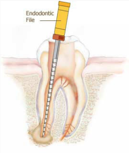

**Endodontia** é a especialidade que tem como objetivo a preservação do dente por meio da prevenção, diagnóstico, prognóstico, tratamento e controle das alterações da polpa e dos tecidos peri-radiculares.

Em casos de alterações:  
- Por cárie; 
- Fraturas dentárias; 
- Trauma dentário; 
- Trauma ortodôntico, 
- Lesões endo-periodontais; 
- Necessidades protéticas; 
- Outras patologias endodônticas, 

Nesses casos acima o **tratamento endodôntico (ou o tratamento de canal)** está indicado, visando a manutenção do dente na cavidade bucal, e a saúde dos tecidos periapicais.

Atualmente temos diversas técnicas e materiais que possibilitam o tratamento endodôntico em apenas uma sessão, diminuindo o desconforto e o tempo de trabalho para o paciente.

## **Realmente precisamos realizar o canal ?**

Sim, é fundamental realizar esse tratamento. Se não for realizado corremos grande risco de ter dor e infecção, ocasionando sua extração. 

Existem casos onde mesmo o paciente não sentindo dor é necessário realizar o canal. Como por exemplo em casos onde existe grande destruição no dente e precisamos realizar o tratamento de reconstrução com coroas dentárias. 

Existe um texto em nosso blog com mais informação sobre o tema. Para ler mais [clique aqui.](https://mdfrossard.com.br/tratamento-de-canal/) 
