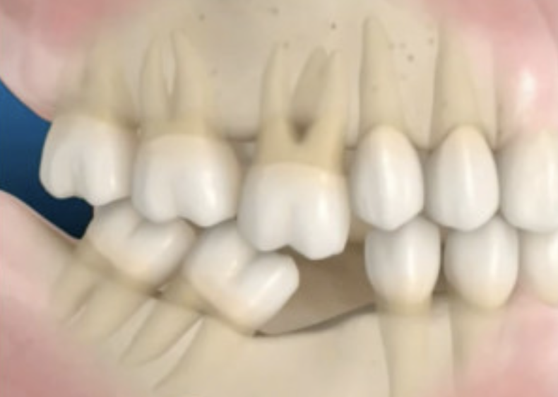
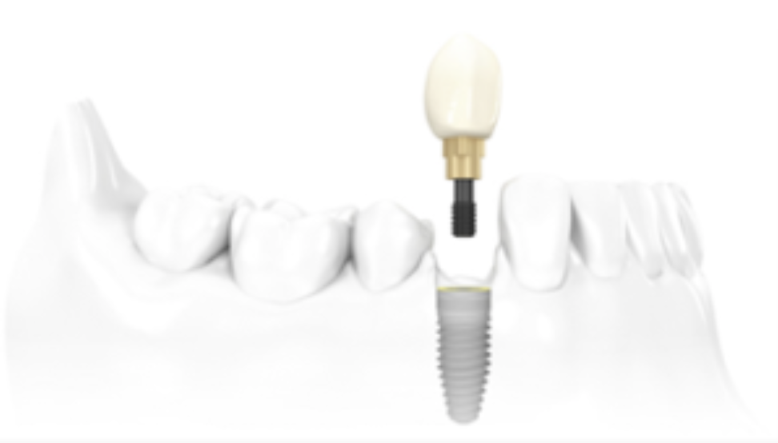
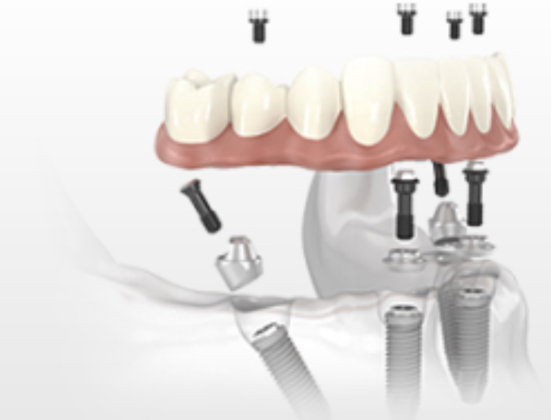
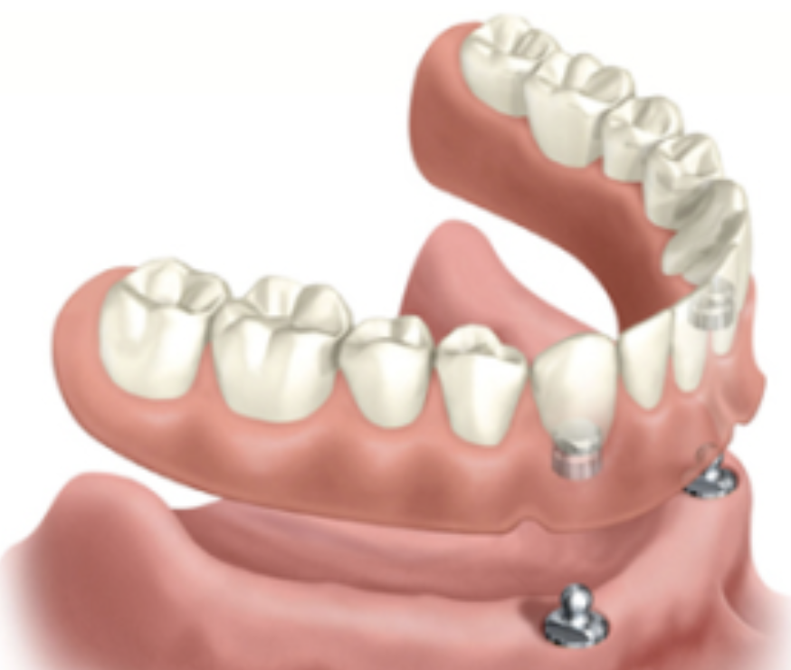

Área que visa a **substuição de dentes/raízes perdidos**, através da instalação de um parafuso de titânio (implante dentário) dentro do osso, abaixo da gengiva do paciente.

Em cima deste, o dentista irá realizar o trabalho protético, ou seja, a colocação do dente.

Assim, os [**implantes dentários**](/implante-dentario/) geram uma grande satisfação ao paciente, por substituir o dente perdido e não ser preciso realizar desgaste ou comprometimento dos dentes vizinhos.

Além disso, as famosas dentaduras e próteses parciais com grampo podem ser substituídas por próteses fixas sobre implantes, melhorando a retenção, mastigação e a estética do paciente.

## **Perguntas freqüentes (Dúvidas)**

####  1 – A falta de dentes pode ser prejudicial?

**Sim**, a falta de um ou vários dentes gera um desequilíbrio da oclusão (mordida) causando perda da estética, dentes desalinhados e problemas/dores articulares.

####  2 – O tratamento com implantes dentais é superior a próteses convencionais?

É superior na maioria dos casos de perda dentária, pois **não há desgaste em dentes adjacentes**. Porém, cada caso deve ser estudado e analisado por um profissional capacitado. Leia mais sobre [próteses fixas aqui](/o-que-e-uma-protese-dentaria-fixa/).

#### 3 – Quais exames são necessários?

Exames **radiográficos, tomográfico, sanguíneos** e outros complementares conforme julgamento do profissional que irá executar o caso.

#### 4 – Instalar implantes dói?

O procedimento é feito sob anestesia local. Por se tratar de uma cirurgia e quando o paciente segue as orientações pós operatórias dadas pelo profissional, há possibilidade de uma pequena dor e inchaço no local que é tratado a base de medicamentos prescritos pelo dentista. Temos um texto completo sobre esse tema, basta [clicar aqui](/sera-que-implante-dentario-doi/).

#### 5 – Posso sofrer rejeição?

Não. O implante é feito em titânio, um material que é biocompatível com o nosso organismo. O que pode acontecer é a falta de ancoragem entre o osso e o implante ou algum tipo de infecção que pode acarretar na perda do implante. [Leia mais aqui](/perder-um-implante-dentario/).

#### 6 – Quais os cuidados de mastigação e limpeza devo ter com os implantes dentários?

Os mesmos de um dente normal: escovação e uso do fio dental.

#### 7 – Para quais pessoas são indicados os implantes?

Pessoas que por algum motivo: **perderam um ou mais elementos dentários; sentem insegurança com a prótese removível, com dificuldade para mastigação, ou quando querem melhorar de alguma forma a estética.**

#### 8 – Qual o tempo de tratamento?

Depende da individualidade de cada caso. Após a instalação do **implante dentário**, este poderá receber uma dente provisório (carga imediata) dependendo do torque de inserção (retenção) do implante no osso. A prótese definitiva, de uma maneira geral, só poderá ser instalada após a cicatrização óssea ao redor do implante e este tempo varia de 2 a 6 meses.

## **Vantagem dos implantes dentários na substituição dos dentes perdidos**

Quando se perde o dente e sua raiz, o osso que o sustenta pode se reabsorver. Em casos totais o osso maxilar inteiro pode reabsorver (“encolher”), dando um aspecto no rosto mais velho.

O **implante dental** mantém o estímulo no osso diminuindo esta reabsorção, com uma prótese convencional (dentadura), isso não é possível.

Dois pontos aqui são importantes destacar:

**1- Conservação dos dentes naturais:** Com as pontes dentárias convencionais, os dentes adjacentes aos dentes perdidos precisam ser desgastados para serem usados como pilares desta ponte. Os **implantes dentários** geralmente eliminam a necessidade de modificar os dentes saudáveis

**2- Alternativa para próteses removíveis:** Antes dos **implantes dentais** a única alternativa para oferecer dentes ao um paciente com grandes perdas dentárias era a instalação de próteses removíveis (dentaduras ou aparelhos parciais removíveis). Estas próteses removíveis possuem mobilidade o que pode gerar insegurança ao paciente. Os **implantes dentários** podem servir de pilares de sustentação para próteses totais fixas. O paciente com próteses bem presas se sentem mais seguros e autoconfiantes.

## **Consequência da ausência dos dentes**

Por diversos motivos, vários pacientes chegam ao consultório dentário com dentes extraídos ou condenados. As razões mais comuns que levam a perda do dente são a doença periodontal avançada e a cárie.

A substituição dos dentes perdidos por implantes dentários se faz necessária visto que a ausência de um ou mais dentes pode ter como consequência:

**Problema 1-  **A movimentação dos dentes vizinhos e o antagonista para a área do dente perdido para preencher o espaço vazio (pois temos um desequilíbrio das forças oclusais);

**Problema 2-**  Quando se perde o dente o osso que o sustenta pode se reabsorver. O **implante** mantém o estímulo no osso diminuindo esta reabsorção;

**Problema 3-**  Um dente perdido na parte frontal da boca pode afetar sua autoestima e sorriso.

Em várias situações, um **implante dentário é a solução estética mais agradável** para substituir o dente perdido. Uma coroa ou ponte fixa sobre este implante fornece uma solução completa e estética para recuperação do equilíbrio da mastigação e sorriso. Um implante ocupa o lugar da raiz do dente perdido e ajuda a prevenir as consequências citadas.

## **Técnica Cirúrgica Guiada (conhecido popularmente como “implante sem corte”)**

Atualmente, as técnicas de **cirúrgicas guiadas** são alternativa conveniente para a instalação de **implantes dentários.**

A principal vantagem desta técnica é a quantidade mínima de manipulação de tecido mole (gengiva) em razão da cirurgia ser sem abertura de retalho, isto **reduz significativamente o tempo de cicatrização e o desconforto.**

Esta técnica necessita do planejamento virtual da cirurgia, a partir de uma tomografia computadorizada e guias cirúrgicos construídos especificamente para cada caso.

## **Alternativa para Próteses Removíveis**

Milhões de pessoas no mundo perderam muitos ou todos os seus dentes e utilizam próteses removíveis chamadas **dentaduras**. Muitas vezes essas próteses removíveis deixam os pacientes inseguros e podem causar dor. Para substituição dessas próteses removíveis podemos utilizar **implantes dentários** (4 ou mais) que servirão de suporte para uma ponte fixa– **Próteses Fixas implanto Suportadas**.

## **Tipos de prótese sobre Implante dentário (classificação):**

As próteses sobre **implante dental** podem ser classificadas em:

#### **1) Prótese Unitária**

#### ** 2) Prótese Múltipla Parcial ** 

#### **3) Prótese Múltipla total (protocolo)**

****

#### **4) Prótese Removível Implanto ****Suportada ****(Overdenture)**

