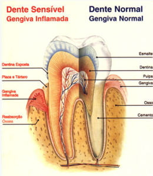

Área da odontologia que estuda e trata as estruturas que suportam os dentes. 

Nela estão inclusos, os:  
* **Tecidos gengivais** ;
* **ligamento periodontal** ; 
* **cemento e osso alveolar** . 

A patologia mais comum nessa área é a **gengivite** (inflamação da gengiva), que acontece geralmente devido à má higiene que acumula placa bacteriana e assim agride a gengiva podendo gerar sangramento durante a escovação, retração gengival e mau hálito no paciente. 

A progressão dessa doença é a **periodontite**, onde ocorre perda de osso e do suporte dentário, podendo causar perda deste elemento. 

Assim, nessa área a **prevenção é essencial.** 

Para prevenir essas doenças, é necessário uma boa escovação, uso do fio dental e um controle periódico do dentista. 

Na **periodontia** podemos ainda realizar pequenas cirurgias muco-periósteas (na gengiva), visando a estética do paciente (plástica gengival).

### Halitose
## A – O que é?
A halitose ou mau hálito é uma condição anormal do hálito com cheiro desagradável. A halitose não é uma doença, mas pode denunciar a ocorrência de alguma alteração ou problema de saúde.

## B – Causas
Estudos recentes afirmam que 90 a 95 % dos casos de halitose possuem origem bucal (Quirynen et al. J Clin Periodontol, 2009, Tangerman A & Winkel E G, J. Breath Res, 2010)

Como causas de origem extra-bucal, consideramos as causas nas vias aéreas superiores e as de origem metabólica ou sistêmica, vindas de dentro do organismo. 

Como sistêmica ou metabólica, temos:  
* Jejum prolongado ;
* A ingestão de alimentos odoríferos (capazes de alterar o hálito); 
* Diabetes não compensado ; 
* Hipoglicemia 
* Alterações hepáticas, renais e intestinais como causas principais.

Vale salientar que problemas relacionados ao estômago muito raramente interferem na condição do hálito alterado, o que por muito tempo, e até os dias de hoje, se constitui numa crença com pouca ou nenhuma evidência científica.

Uma das causas mais comuns é a diminuição da produção de saliva, ocasionada principalmente por remédios que a pessoa possa estar tomando e que diminuam a salivação, outras causa são,stress excessivo, certas doenças, etc..

Essa diminuição da quantidade de saliva favorece a formação de uma placa bacteriana (camada esbranquiçada) na parte posterior da língua, chamada de saburra lingual e no interior das amígdalas, em forma de uma pequena bolinha amarelada, chamadas cáseos amigdalianos. 

Elas são formadas por restos proteicos alimentares e salivares, células que se descamam da mucosa bucal e bactérias. Estas bactérias se alimentam das proteínas presentes nestas células e restos proteicos e nesse processo ocorre a liberação de enxofre, em forma de compostos sulfurados voláteis (CSVs), que são os gases que causam um hálito alterado e desagradável.

As doenças da gengiva bem como várias outras causas de alteração do hálito de origem bucal, são : 
* Dentes semi-inclusos; 
* Excessos gengiba ;
* feridas cirúrgicas ;  
* Cáries abertas e extensas ; 
* Próteses mal adaptadas ; 
* Abscessos ; 
* Câncer bucal. 

Elas podem ser facilmente identificadas e tratadas (ou encaminhadas para tratamento) por um Cirurgião Dentista experiente.

## C – Recomendações
* Beba bastante água, pelo menos dois litros por dia, para manter a boca sempre umedecida;
* Realize pequenas refeições a cada 03 horas, pois jejum prolongado pode comprometer seu hálito;
* Realize adequada higiene bucal (incluindo limpeza da língua) evitando o uso de soluções para bochecho com álcool.
* Visite o dentista, isso vai prevenir problemas gengivais e principalmente o acúmulo de tártaro, que é prejudicial ao hálito.
* Capriche na higiene bucal. Quando escovar os dentes, use também o fio dental e passe a escova com delicadeza especialmente na região posterior da língua.
* Certifique-se de que os níveis de glicemia estão dentro da normalidade e que o funcionamento do estômago, rins e intestinos não apresentam nenhuma alteração; Utilize, de vez em quando, goma de mascar ou balas sem açúcar, que ajudam a aumentar a salivação.
* Realize exames de saúde geral (check-up) anualmente, pratique atividades físicas para reduzir o estresse.