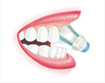
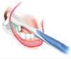
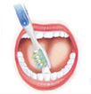
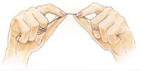

A **prevenção das doenças bucais** é a melhor abordagem na odontologia. Para isso orientamos nossos pacientes a técnica correta de higienização, fazendo uso da escova, do fio dental, do controle de placa (profilaxia) e do uso do flúor. Com isso impedimos que ocorra cárie ou doença periodontal.

Na manutenção realizamos consultas após o término do tratamento, visando a maior **durabilidade da reabilitação dentária e estética.** O maior objetivo é orientar o paciente quanto a higienização, mantendo a saúde gengival e a integridade óssea.

Essas consultas são realizadas geralmente entre 4 a 6 meses após o término do tratamento, e são feitos levantamento do índice de placa, limpeza mecânica. Uma nova avaliação será feita, na qual poderemos diagnosticar precocemente algum problema e intervir o mais rápido possível.

Antes de começarmos um tratamento, sempre realizamos uma anamnese, onde nela obtemos a historia médica e odontológica pregressa. O objetivo desta é saber se o paciente apresenta algum problema de saúde (como diabetes e pressão alta descontroladas) alergia ou se utiliza algum medicamento que possa interferir no plano de tratamento.

## **A – Técnica escovação**

O primeiro passo para manter dentes e gengiva saudáveis é uma escovação apropriada. Para fazer um bom trabalho de escovação necessita-se de pelo menos dois minutos usando uma técnica recomendada. Esteja você usando uma escova de dentes normal ou uma escova de dentes elétrica, você deve escovar cada seção de sua boca no mínimo 30 segundos (superior direita e esquerda, inferior direita e esquerda).

**Primeira Etapa**

Para as superfícies externas dos dentes, posicione a escova de dentes em um ângulo de 45 graus em direção da linha gengival. Use movimentos rítmicos suaves e curtos, movendo a escova para cima e para baixo contra os dentes e a gengiva.

**Segunda Etapa**

Use esse mesmo movimento para limpar as superfícies de mastigação e internas dos dentes.

**Terceira Etapa**

Para limpar as superfícies internas dos dentes da frente, segure a escova verticalmente e use movimentos rítmicos suaves para cima e para baixo com a ponta da cabeça da escova.

**Quarta Etapa**

Não se esqueça de escovar ao longo da linha gengival, e certifique-se de que você alcançou os dentes bem no fundo. Escove também a sua língua – isso ajudará a deixar seu hálito fresco.

## B -Limpeza entre dentes (uso do fio dental)

É importante limpar entre os dentes porque isto é a linha de frente da defesa na **prevenção das doenças de gengiva e o mau hálito**, e pode desempenhar um importante papel na perda dos dentes também. O fio dental permite você atingir áreas que estão fora do alcance de sua escova de dentes.

O uso diário do **fio dental** é um dos modos mais comuns de limpar entre os dentes. Peça uma orientação a seu dentista. Entretanto, aqui está um exemplo de um método freqüentemente recomendado.

**Passo 1**

Pegue cerca de 50 centímetros de fio dental e enrole frouxamente a maior parte dele em volta de cada dedo médio (enrole mais em um dedo do que no outro) deixando 5 centímetros de fio entre eles.

**Passo 2**

Com os seus polegares e os dedos indicadores segurando o fio estendido, deslize-o suavemente para baixo entre os seus dentes, tomando cuidado para não pressioná-lo contra a sua gengiva.

**Passo 3**

Curve o fio em volta de cada dente dando a forma de um “C” e mova-o para cima e para baixo nos lados de cada dente, inclusive abaixo da linha gengival. Desenrole um novo pedaço do fio conforme você passa de dente para dente. Logo no início, passar o **fio dental** pode parecer um tanto incômodo. Mas insista! Com apenas um pouco de paciência e um pouco de prática, isto se tornará tão natural como escovar os seus dentes.

O fato é que o uso do **fio dental** proporciona benefícios inquestionáveis que começam no primeiro dia. Após o uso do **fio dental**, seus dentes e suas gengivas parecerão mais limpos uma vez que o fio alcança áreas que a sua escova de dentes não consegue alcançar. Seu hálito ficará mais fresco, e a saúde de suas gengivas irá melhorar. Mesmo que no início possa parecer incômodo, continue praticando. Muito em breve você sentirá a diferença e sentirá que isto já se tornou parte da sua rotina diária.

É muito comum as suas gengivas sangrarem quando você começa a usar o **fio dental** pela primeira vez. Isto pode ser um sinal de que você tem alguma forma de doença nas gengivas. Após alguns poucos dias de uso do fio dental, o sangramento deve parar conforme suas gengivas se tornam mais saudáveis. Se o sangramento persistir, consulte o seu dentista.

Embora exista um grande número de tipos diferentes de **fios dentais**, todos são próprios para alcançar entre os dentes e abaixo da linha gengival para remover a placa. O fator mais importante é achar um fio dental que seja mais confortável e fácil para você usar.

Se você usa aparelhos ortodônticos ou tem restauração dentária (como uma ponte) que interferem com o uso normal do fio dental, você pode utilizar um fio dental de inserção. Oral-B SuperFloss® é único, pois tem três seções em cada segmento de fio: uma ponta rígida que permite inseri-lo entre os dentes, em volta do aparelho, ou sob a ponte; um fio mais esponjoso, para a limpeza de espaços mais amplos, e um fio normal para a limpeza dos dentes.