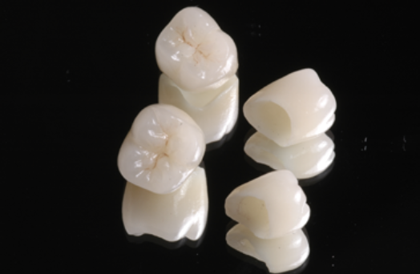
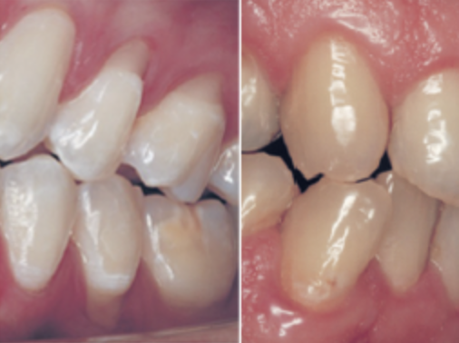
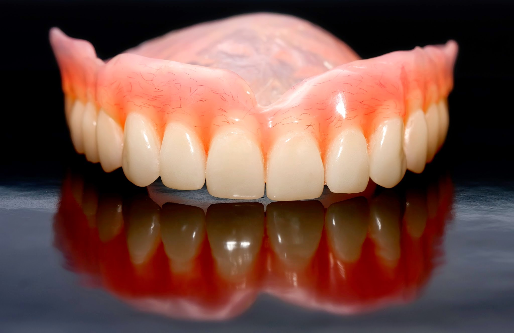

Área da odontologia que visa recuperar elementos dentários perdidos ou cariados restabelecendo a harmonia bucal, sua função e estética. 

Podemos realizar trabalhos que vão desde próteses unitárias (um dente apenas), próteses sobre implantes, próteses totais e até uma reabilitação em todos os dentes. 

Hoje ainda, com novas tecnologias, como uso de zircônia ao invés de metal ou a tecnologia cad/cam, podemos realizar próteses mais estéticas e com ótima adaptação.

## Coroas

É uma restauração cimentada que recobre ou reveste a superfície externa da coroa clinica. 

Deve reproduzir a morfologia e os contornos das porções coronárias danificadas do dente enquanto desempenha suas funções.

## Prótese parcial fixa (Ponte)

É uma aplicação que fica permanentemente ligada aos dentes remanescentes, substituindo um ou mais dente ausente. 

Esse tipo de restauração há muito tempo é chamada de ponte. Pode ser confeccionada em metalocerâmica, metaloplástica e porcelana.

## Inlay e Onlay ( Bloco )

Tem por finalidade restaurar dentes destruídos por cárie ou traumatismo, que resultam na perda parcial da porção coronária.

## Coroas totalmente cerâmicas

As coroas e pontes eram tradicionalmente feitas em metalo-cerâmicas, na qual uma infraestrutura metálica é confeccionada com intuito de oferecer resistência a após recoberta com uma cerâmica de cobertura dando a estética necessária.

Estas coroas e pontes funcionam bem, porém, atualmente contamos com materiais que além de oferecerem a resistência necessária para suportar a força da mastigação também contam com uma característica estética por não possuírem a cor metálica, como por exemplo a Zircônia.

### Vantagens das coroas totalmente cerâmicas

*   **Ausência de linhas acinzentadas:**  

    A gengiva em volta dos dentes pode retrair por vários motivos, dentre eles uma técnica de escovação inapropriada, se este dente estiver sido tratado com uma coroa metalocerâmica a margem metálica pode dar um efeito acinzentado na gengiva, o que não acontece com coroas em cerâmica pura.

*   **Biocompatibilidade da zircônia:**  

    A zircônia, material empregado como infraestrutura das coroas totalmente cerâmicas, é um material biocompatível cientificamente comprovado. Biocompatibilidade é a capacidade de se integrar de forma harmônica com os tecidos que o rodeiam. Fomentando de forma natural a adaptação da gengiva ao redor das coroas totalmente cerâmica.

## Problemas de oclusão (mordida) – Como reconhecer?

Os sinais de que o dentes possam estar sob estresse podem ser aferidos por meio de um exame clinico rigoroso, e as doenças dentais mais frequentes são: 
* Abfrações; 
* Mobilidade ; 
* Recessão gengival ;
* Desgastes dentários acentuados não compatíveis com a idade cronológica ;
* Trincas ;
* Fraturas recorrentes de restaurações ;
* Reabsorções rRadiculares.

Alguns sintomas também podem ser aferidos, tais como: 
* Pericementite; 
* Sensibilidade térmica; 
* Odontalgias. 

O tratamento poderá ser protético, ortodôntico ou cirúrgico.

## Prótese dentária removível

Prótese dentária removível é destinada à reposição de dentes perdidos e tecidos adjacentes através de uma prótese planejada para ser removida pelo usuário.

Podem ser classificadas como totais (dentadura) ou parciais, de acordo com a presença/ausência de dentes. 

É importante notar que as próteses removíveis com o tempo devem ser substituídas porque o osso e gengiva vão regredindo. 

Outra solução é a reabilitação com prótese Fixa ou implantes.

---

## Prótese total (Dentadura)

Para pessoas que perderam os dentes em decorrência de doenças ou lesões, as dentaduras podem restaurar o sorriso e auxiliar nas atividades do dia a dia, como comer e falar. 

No entanto, acostumar-se ao uso das dentaduras pode exigir um período de adaptação. (Dentaduras novas podem provocar uma sensação estranha por algumas semanas até você se acostumar com elas).

As **dentaduras podem parecer frouxas** até que os músculos das bochechas e da língua aprendam a mantê-las em posição. Não é incomum surgirem irritações ou feridas. Você pode sentir que o fluxo salivar aumenta temporariamente. 

Conforme sua boca se acostuma às dentaduras, esses problemas devem diminuir. Uma ou mais consultas de acompanhamento com o dentista geralmente são necessárias após a instalação de uma dentadura. Se qualquer problema persistir, particularmente irritação ou ferimentos, não deixe de consultar o dentista.

**A alimentação exigirá um pouco de prática.** Comece com alimentos moles cortados em pedaços pequenos. 

Mastigue lentamente usando os dois lados da boca ao mesmo tempo para evitar que as dentaduras se desloquem. Conforme se acostumar a mastigar, acrescente outros alimentos até retomar a dieta normal. Continue a mastigar os alimentos usando os dois lados da boca ao mesmo tempo.

Tome cuidado com alimentos quentes ou duros e ossos ou cascas com pontas afiadas.

**Pronunciar certas palavras pode exigir prática.** Ler em voz alta e repetir palavras complicadas pode ajudar. Se suas dentaduras fizerem barulho enquanto você fala, fale mais devagar. 

Você pode sentir as dentaduras ocasionalmente escorregarem ao rir, tossir ou sorrir. Reposicione as dentaduras mordendo delicadamente e engolindo. 

Se algum problema de fala persistir, consulte o dentista.